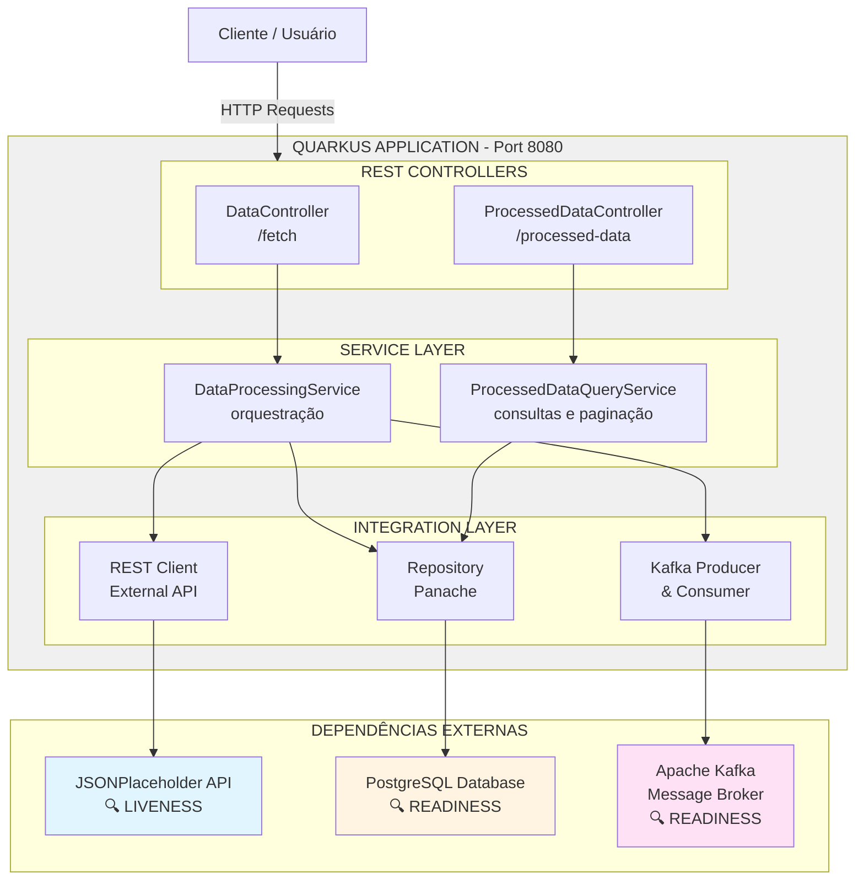
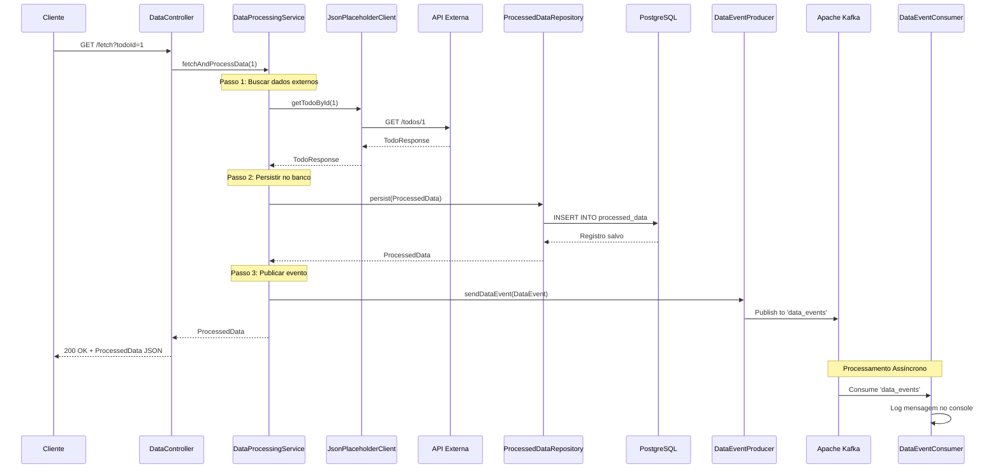
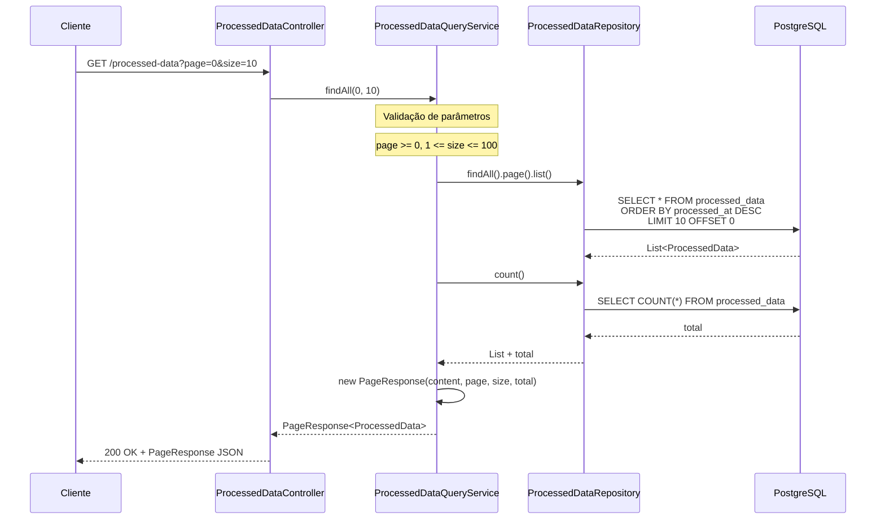
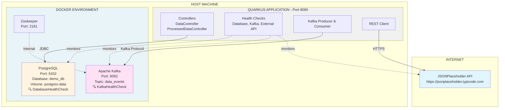
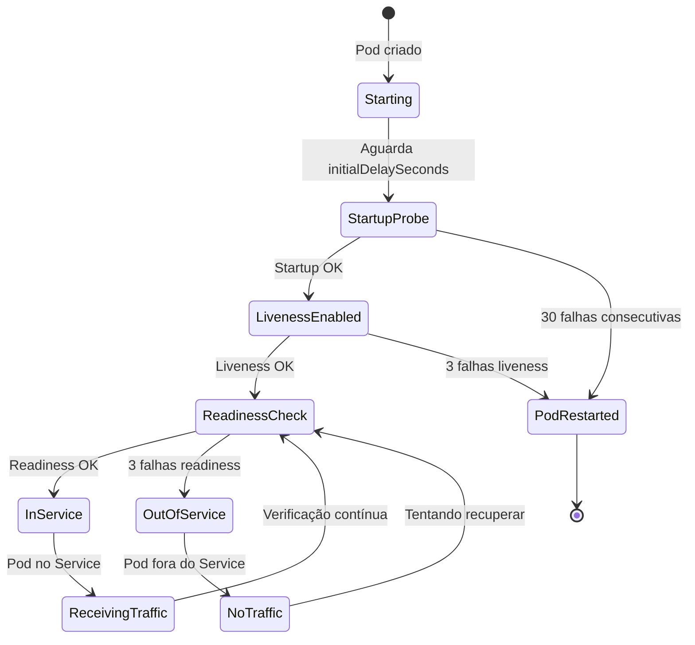

# Topologia e Arquitetura da Aplicação

## Visão Geral

Esta aplicação demonstra uma arquitetura de microsserviços integrando três componentes principais: **API Externa**, **Apache Kafka** e **PostgreSQL**. A aplicação também implementa monitoramento de saúde através do **SmallRye Health**.

---

## Arquitetura da Aplicação



---

## Fluxo de Dados Completo

### 1. Processamento de Dados (Endpoint `/fetch`)



### 2. Consulta de Dados (Endpoint `/processed-data`)



---

## Componentes da Aplicação

### 📦 Camada de Apresentação (Controllers)

| Componente | Endpoint Base | Responsabilidade |
|------------|---------------|------------------|
| **DataController** | `/fetch` | Processa dados externos e dispara integração |
| **ProcessedDataController** | `/processed-data` | Consulta dados processados com paginação |

### 🔧 Camada de Serviço (Services)

| Componente | Responsabilidade |
|------------|------------------|
| **DataProcessingService** | Orquestra o fluxo: API Externa → PostgreSQL → Kafka |
| **ProcessedDataQueryService** | Gerencia consultas paginadas e estatísticas |

### 💾 Camada de Persistência

| Componente | Tecnologia | Responsabilidade |
|------------|-----------|------------------|
| **ProcessedDataRepository** | Panache Repository | CRUD de dados processados |
| **ProcessedData** | JPA Entity | Entidade mapeada para tabela `processed_data` |

### 🔌 Integrações Externas

| Componente | Tipo | Destino |
|------------|------|---------|
| **JsonPlaceholderClient** | REST Client | https://jsonplaceholder.typicode.com |
| **DataEventProducer** | Kafka Producer | Tópico: `data_events` |
| **DataEventConsumer** | Kafka Consumer | Tópico: `data_events` |

---

## Monitoramento com SmallRye Health

### 🏥 Health Check Coverage Map

```
┌───────────────────────────────────────────────────────────────────┐
│                    HEALTH CHECK ENDPOINTS                         │
├───────────────────────────────────────────────────────────────────┤
│                                                                   │
│  GET /health        → Status geral (combina live + ready)        │
│  GET /health/live   → Liveness Probes                            │
│  GET /health/ready  → Readiness Probes                           │
│                                                                   │
└───────────────────────────────────────────────────────────────────┘
```

### 🔍 Health Checks Implementados

#### 1. **Liveness Probes** (Aplicação está viva?)

| Health Check | Componente Verificado | Classe | O que verifica |
|--------------|----------------------|--------|----------------|
| **External API Health Check** | JSONPlaceholder API | `ExternalApiHealthCheck` | Faz uma chamada real para `getTodoById(1)` e verifica se recebe resposta válida |

**Resposta de Sucesso:**
```json
{
  "status": "UP",
  "checks": [
    {
      "name": "External API health check",
      "status": "UP",
      "data": {
        "api": "JSONPlaceholder",
        "url": "https://jsonplaceholder.typicode.com",
        "status": "available"
      }
    }
  ]
}
```

#### 2. **Readiness Probes** (Aplicação está pronta?)

| Health Check | Componente Verificado | Classe | O que verifica |
|--------------|----------------------|--------|----------------|
| **Database Health Check** | PostgreSQL | `DatabaseHealthCheck` | Testa conexão com `connection.isValid(5)` e timeout de 5 segundos |
| **Kafka Health Check** | Apache Kafka | `KafkaHealthCheck` | Usa AdminClient para listar tópicos e verifica conectividade com broker |

**Resposta de Sucesso:**
```json
{
  "status": "UP",
  "checks": [
    {
      "name": "Database connection health check",
      "status": "UP",
      "data": {
        "database": "PostgreSQL",
        "status": "connected"
      }
    },
    {
      "name": "Kafka connection health check",
      "status": "UP",
      "data": {
        "broker": "localhost:9092",
        "status": "connected"
      }
    }
  ]
}
```

---

## Dependências Externas e Cobertura de Health Checks

### 📊 Matriz de Cobertura

| Dependência Externa | Tipo | Porta/URL | Health Check | Probe Type | Status |
|---------------------|------|-----------|--------------|------------|--------|
| **PostgreSQL** | Database | `localhost:5432` | ✅ DatabaseHealthCheck | Readiness | Ativo |
| **Apache Kafka** | Message Broker | `localhost:9092` | ✅ KafkaHealthCheck | Readiness | Ativo |
| **Zookeeper** | Coordinator | `localhost:2181` | ⚠️ Coberto indiretamente via Kafka | - | Passivo |
| **JSONPlaceholder API** | REST API | `https://jsonplaceholder.typicode.com` | ✅ ExternalApiHealthCheck | Liveness | Ativo |

**Legenda:**
- ✅ = Health check implementado
- ⚠️ = Coberto indiretamente
- ❌ = Sem health check

---

## Docker Compose - Infraestrutura

### Serviços Configurados

```yaml
services:
  postgres:
    - Database: demo_db
    - User: postgres
    - Port: 5432
    - Health: ✅ DatabaseHealthCheck
    
  zookeeper:
    - Port: 2181
    - Health: ⚠️ Verificado indiretamente via Kafka
    
  kafka:
    - Broker: localhost:9092
    - Topic: data_events
    - Health: ✅ KafkaHealthCheck
```

---

## Endpoints da Aplicação

### 🔄 Processamento

| Método | Endpoint | Descrição | Integrações Utilizadas |
|--------|----------|-----------|------------------------|
| GET | `/fetch` | Busca dados da API externa, salva no banco e publica no Kafka | API Externa + PostgreSQL + Kafka |
| GET | `/fetch?todoId={id}` | Busca um TODO específico | API Externa + PostgreSQL + Kafka |

### 📊 Consultas

| Método | Endpoint | Descrição | Integrações Utilizadas |
|--------|----------|-----------|------------------------|
| GET | `/processed-data` | Lista dados processados (paginado) | PostgreSQL |
| GET | `/processed-data/{id}` | Busca por ID | PostgreSQL |
| GET | `/processed-data/recent?limit=10` | Lista mais recentes | PostgreSQL |
| GET | `/processed-data/stats` | Estatísticas | PostgreSQL |

### 🏥 Health Checks

| Método | Endpoint | Descrição | Componentes Verificados |
|--------|----------|-----------|------------------------|
| GET | `/health` | Status geral | PostgreSQL + Kafka + API Externa |
| GET | `/health/live` | Liveness probe | API Externa |
| GET | `/health/ready` | Readiness probe | PostgreSQL + Kafka |

### 📚 Documentação

| Método | Endpoint | Descrição |
|--------|----------|-----------|
| GET | `/swagger-ui` | Interface Swagger UI |
| GET | `/q/openapi` | Especificação OpenAPI (JSON) |
| GET | `/q/dev` | Quarkus Dev UI (apenas dev mode) |

---

## Tecnologias Utilizadas

### Core Framework
- **Quarkus 3.29.0** - Framework supersônico e subatômico

### Persistência
- **Hibernate ORM with Panache** - Simplificação do JPA
- **PostgreSQL** - Banco de dados relacional
- **JDBC Driver** - Conectividade com banco

### Messaging
- **SmallRye Reactive Messaging** - Integração reativa com Kafka
- **Apache Kafka** - Plataforma de streaming de eventos
- **String Serialization** - Serialização manual com Jackson

### Integração
- **MicroProfile REST Client** - Cliente HTTP declarativo
- **Jackson** - Serialização/deserialização JSON

### Monitoramento e Documentação
- **SmallRye Health** - Health checks (liveness e readiness)
- **SmallRye OpenAPI** - Geração automática de documentação
- **Swagger UI** - Interface interativa para testes

---

## Diagrama de Deployment



---

## Resumo da Cobertura de Health Checks

### ✅ Componentes Monitorados

1. **PostgreSQL** (Readiness)
   - Conexão ativa
   - Validação de timeout
   - Dados: database, status

2. **Apache Kafka** (Readiness)
   - Conectividade com broker
   - Listagem de tópicos
   - Dados: broker, status

3. **API Externa** (Liveness)
   - Disponibilidade da API
   - Resposta válida
   - Dados: api, url, status

### 🎯 Estratégia de Monitoramento

- **Liveness Probes**: Verifica se a aplicação precisa ser reiniciada
  - API Externa falhando → aplicação deve ser reiniciada

- **Readiness Probes**: Verifica se a aplicação pode receber tráfego
  - PostgreSQL ou Kafka indisponíveis → aplicação não está pronta
  - Tráfego não deve ser direcionado até que estejam disponíveis

---

## Deployment Kubernetes

### 📦 Estrutura de Manifestos

A aplicação possui manifestos Kubernetes completos no diretório `k8s/`:

```
k8s/
├── namespace.yaml                # Namespace health-api-demo
├── configmap.yaml               # Configurações (URLs, portas)
├── secret.yaml                  # Credenciais do PostgreSQL
├── postgres-deployment.yaml     # PostgreSQL + Service + PVC
├── kafka-deployment.yaml        # Kafka + Zookeeper + Services
├── application-deployment.yaml  # App Quarkus + Services
└── README.md                    # Guia completo de deploy
```

### 🔍 Configuração de Health Probes no Kubernetes

#### Liveness Probe - Aplicação

```yaml
livenessProbe:
  httpGet:
    path: /health/live          # Endpoint SmallRye Health
    port: 8080
    scheme: HTTP
  initialDelaySeconds: 60       # Aguarda 60s após start
  periodSeconds: 15             # Verifica a cada 15s
  timeoutSeconds: 5             # Timeout de 5s
  successThreshold: 1           # 1 sucesso = UP
  failureThreshold: 3           # 3 falhas = RESTART POD
```

**Verifica:** API Externa JSONPlaceholder

**Ação em caso de falha:** Kubernetes **reinicia o pod**

#### Readiness Probe - Aplicação

```yaml
readinessProbe:
  httpGet:
    path: /health/ready         # Endpoint SmallRye Health
    port: 8080
    scheme: HTTP
  initialDelaySeconds: 30       # Aguarda 30s após start
  periodSeconds: 10             # Verifica a cada 10s
  timeoutSeconds: 5             # Timeout de 5s
  successThreshold: 1           # 1 sucesso = READY
  failureThreshold: 3           # 3 falhas = REMOVE DO SERVICE
```

**Verifica:** PostgreSQL + Kafka

**Ação em caso de falha:** Pod é **removido do Service** (não recebe tráfego)

#### Startup Probe - Aplicação

```yaml
startupProbe:
  httpGet:
    path: /health/live
    port: 8080
  initialDelaySeconds: 10
  periodSeconds: 10
  failureThreshold: 30          # Até 5 minutos (10s × 30)
```

**Propósito:** Protege aplicações com inicialização lenta

**Comportamento:** Desabilita liveness e readiness até ser bem-sucedido

### 🔄 Ciclo de Vida dos Probes



### 📊 Matriz de Decisão dos Probes

| Probe | Passa | Falha | Ação do Kubernetes |
|-------|-------|-------|-------------------|
| **Startup** | ✅ Habilita liveness/readiness | ❌ Após 30 falhas | **RESTART POD** |
| **Liveness** | ✅ Pod continua rodando | ❌ Após 3 falhas | **RESTART POD** |
| **Readiness** | ✅ Pod recebe tráfego | ❌ Após 3 falhas | **REMOVE DO SERVICE** |

### 🧪 Cenários de Teste

#### Cenário 1: PostgreSQL Indisponível

```
1. PostgreSQL fica indisponível
2. Readiness probe falha (DatabaseHealthCheck)
3. Após 3 falhas consecutivas (30s total)
4. Pod é removido do Service
5. Tráfego não chega mais neste pod
6. PostgreSQL volta
7. Readiness probe passa
8. Pod é adicionado de volta ao Service
```

#### Cenário 2: Kafka Indisponível

```
1. Kafka fica indisponível
2. Readiness probe falha (KafkaHealthCheck)
3. Após 3 falhas consecutivas (30s total)
4. Pod é removido do Service
5. Comportamento idêntico ao PostgreSQL
```

#### Cenário 3: API Externa Indisponível

```
1. API JSONPlaceholder fica indisponível
2. Liveness probe falha (ExternalApiHealthCheck)
3. Após 3 falhas consecutivas (45s total)
4. Kubernetes REINICIA o pod
5. Startup probe aguarda até 5 minutos
6. Se API voltar, pod passa para Ready
7. Se não voltar em 5 min, pod é reiniciado novamente
```

### 🚀 Deploy Rápido

```bash
# 1. Aplicar todos os manifestos
kubectl apply -f k8s/

# 2. Verificar status
kubectl get pods -n health-api-demo -w

# 3. Verificar health checks
kubectl port-forward -n health-api-demo svc/health-api-service-internal 8080:8080
curl http://localhost:8080/health
```

### 📈 Monitoramento de Probes

```bash
# Ver eventos de probes
kubectl describe pod <pod-name> -n health-api-demo | grep -A 10 "Events:"

# Ver status atual dos probes
kubectl get pods -n health-api-demo -o wide

# Logs quando probe falha
kubectl logs -n health-api-demo <pod-name> --previous
```

---

## Melhorias Futuras Sugeridas

1. **Métricas com Micrometer**
   - Adicionar `quarkus-micrometer-registry-prometheus`
   - Endpoint `/metrics` para Prometheus

2. **Tracing Distribuído**
   - Adicionar `quarkus-opentelemetry`
   - Rastreamento de requisições através dos componentes

3. **Circuit Breaker**
   - Adicionar `quarkus-smallrye-fault-tolerance`
   - Proteção contra falhas em cascata

4. **Cache**
   - Adicionar `quarkus-cache`
   - Cache de consultas frequentes

---

**Documentação gerada em:** 2025-11-02  
**Versão da Aplicação:** 1.0.0  
**Autor:** Edge Search
